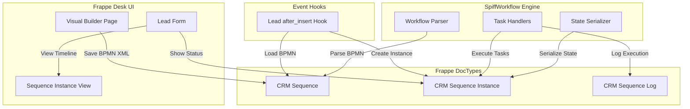
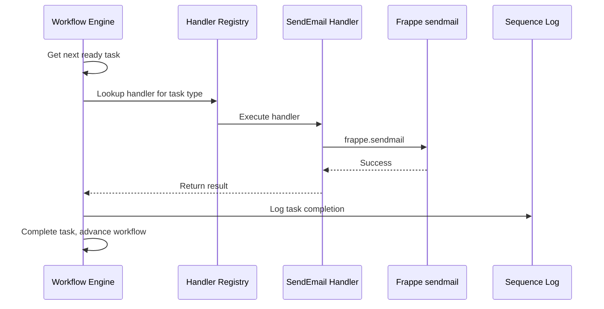

# Phase 1 Implementation Plan: SpiffWorkflow + Frappe CRM Integration

## Executive Summary

This plan details the implementation of native BPMN workflow automation in Frappe CRM using SpiffWorkflow. Phase 1 focuses on proving the architecture with a single working node type (Send Email).

---

## Architecture Overview



---

## 1. DocType Structures

### 1.1 CRM Sequence

Stores workflow definitions as BPMN XML.

| Field | Type | Description |
|-------|------|-------------|
| name | Data | Sequence name |
| bpmn_xml | Code | BPMN 2.0 XML from modeler |
| trigger_doctype | Link | DocType that triggers this sequence - default: CRM Lead |
| trigger_event | Select | Event type: after_insert, on_update, etc. |
| is_active | Check | Active/inactive flag |
| description | Text | User description |

**Permissions:** System Manager, Sales Manager can create/edit

### 1.2 CRM Sequence Instance

Per-document workflow execution state.

| Field | Type | Description |
|-------|------|-------------|
| sequence | Link | Reference to CRM Sequence |
| reference_doctype | Link | DocType of triggering document |
| reference_name | Data | ID of triggering document |
| workflow_state | Code | Serialized SpiffWorkflow state as JSON |
| status | Select | Running, Completed, Error, Paused |
| started_at | Datetime | When workflow started |
| completed_at | Datetime | When workflow completed |
| error_message | Text | Error details if status is Error |

**Permissions:** Users can view instances for documents they have access to

### 1.3 CRM Sequence Log

Execution history for each workflow step.

| Field | Type | Description |
|-------|------|-------------|
| sequence_instance | Link | Reference to CRM Sequence Instance |
| task_name | Data | BPMN task identifier |
| task_type | Data | Type: SendEmail, ScriptTask, Gateway, etc. |
| status | Select | Pending, Running, Completed, Error |
| started_at | Datetime | Task start time |
| completed_at | Datetime | Task completion time |
| input_data | Code | JSON input to task |
| output_data | Code | JSON output from task |
| error_details | Text | Error message if failed |

---

## 2. Visual Workflow Builder Integration

### 2.1 Approach: Frappe Page with Embedded bpmn-js-spiffworkflow

The most straightforward approach is to create a Frappe Page that loads the bpmn-js-spiffworkflow modeler.

### 2.2 File Structure

```
frappe_sequence_builder/
├── public/
│   ├── js/
│   │   ├── sequence_builder_page.js    # Page controller
│   │   └── modeler_customization.js    # Custom palette, properties panel
│   └── css/
│       └── sequence_builder.css        # Modeler styling
├── templates/
│   └── pages/
│       └── sequence_builder.html       # Page template
├── frappe_sequence_builder/
│   └── page/
│       └── sequence_builder/
│           ├── sequence_builder.json   # Page definition
│           ├── sequence_builder.py     # Python API
│           └── sequence_builder.js     # Frontend entry
```

### 2.3 bpmn-js-spiffworkflow Integration

**NPM Dependencies** added to `package.json`:
```json
{
  "dependencies": {
    "bpmn-js-spiffworkflow": "^0.9.0",
    "bpmn-js": "^17.0.0"
  }
}
```

**Modeler Initialization** in `sequence_builder.js`:
```javascript
// Pseudocode structure
import BpmnModeler from 'bpmn-js-spiffworkflow/lib/Modeler';

frappe.pages['sequence-builder'].on_page_load = function(wrapper) {
    const modeler = new BpmnModeler({
        container: '#canvas',
        keyboard: { bindTo: document }
    });
    
    // Load default diagram with Start -> End
    modeler.importXML(defaultDiagram);
    
    // Setup save handler
    frappe.ui.toolbar.add_menu_item('Save Sequence', () => {
        modeler.saveXML({ format: true }, (err, xml) => {
            frappe.call({
                method: 'save_sequence',
                args: { bpmn_xml: xml, ... }
            });
        });
    });
};
```

### 2.4 Custom Task Palette

SpiffWorkflow provides custom task types. We expose them in the palette:

| Task Type | Palette Label | Phase 1 Status |
|-----------|---------------|----------------|
| Send Email | Send Email | **Fully Implemented** |
| Wait Timer | Wait Timer | Visible only |
| Exclusive Gateway | IF-ELSE | Visible only |
| Script Task | Run Script | Visible only |

### 2.5 Properties Panel Configuration

Custom properties panel for Send Email task:
- **To:** Expression or field reference - e.g., `{{doc.email_id}}`
- **Subject:** Email subject line
- **Body:** Email content with Jinja templating

---

## 3. Task Handler Registration Pattern

### 3.1 Handler Registry Structure

```python
# frappe_sequence_builder/handlers/__init__.py

TASK_HANDLERS = {}

def register_handler(task_type):
    """Decorator to register task handlers"""
    def decorator(func):
        TASK_HANDLERS[task_type] = func
        return func
    return decorator
```

### 3.2 Send Email Handler Implementation

```python
# frappe_sequence_builder/handlers/email_handler.py

from frappe_sequence_builder.handlers import register_handler
import frappe

@register_handler('SendEmail')
def handle_send_email(task, workflow_instance):
    """
    Execute Send Email task from BPMN workflow.
    
    Args:
        task: SpiffWorkflow task object
        workflow_instance: CRM Sequence Instance document
    
    Returns:
        dict: Result data to store in task output
    """
    # Get task properties from BPMN extension elements
    properties = task.task_spec.extensions or {}
    
    # Resolve template variables from workflow context
    context = workflow_instance.get_context()
    
    to_addr = frappe.render_template(properties.get('to'), context)
    subject = frappe.render_template(properties.get('subject'), context)
    body = frappe.render_template(properties.get('body'), context)
    
    # Send email via Frappe
    frappe.sendmail(
        recipients=[to_addr],
        subject=subject,
        message=body,
        reference_doctype=workflow_instance.reference_doctype,
        reference_name=workflow_instance.reference_name
    )
    
    return {'sent': True, 'to': to_addr}
```

### 3.3 Handler Execution Flow



---

## 4. Lead Hook Integration

### 4.1 Hook Configuration

In `hooks.py`:
```python
doc_events = {
    "CRM Lead": {
        "after_insert": "frappe_sequence_builder.triggers.lead.after_insert"
    }
}
```

### 4.2 Trigger Implementation

```python
# frappe_sequence_builder/triggers/lead.py

import frappe
from frappe_sequence_builder.engine import start_workflow

def after_insert(doc, method):
    """Trigger active sequences when Lead is created"""
    sequences = frappe.get_all(
        'CRM Sequence',
        filters={
            'trigger_doctype': 'CRM Lead',
            'trigger_event': 'after_insert',
            'is_active': 1
        }
    )
    
    for seq in sequences:
        start_workflow(
            sequence_name=seq.name,
            reference_doctype='CRM Lead',
            reference_name=doc.name
        )
```

### 4.3 Workflow Engine Wrapper

```python
# frappe_sequence_builder/engine/__init__.py

from SpiffWorkflow.bpmn import BpmnWorkflow
from SpiffWorkflow.bpmn.parser import BpmnParser
from frappe_sequence_builder.handlers import TASK_HANDLERS

def start_workflow(sequence_name, reference_doctype, reference_name):
    """Start a new workflow instance for a document"""
    
    # Load sequence definition
    sequence = frappe.get_doc('CRM Sequence', sequence_name)
    
    # Parse BPMN
    parser = BpmnParser()
    parser.add_bpmn_xml(sequence.bpmn_xml)
    spec = parser.get_spec('Process_1')  # Default process ID
    
    # Create workflow
    workflow = BpmnWorkflow(spec)
    
    # Create instance record
    instance = frappe.get_doc({
        'doctype': 'CRM Sequence Instance',
        'sequence': sequence_name,
        'reference_doctype': reference_doctype,
        'reference_name': reference_name,
        'status': 'Running',
        'started_at': frappe.utils.now()
    })
    instance.insert()
    
    # Execute workflow
    execute_workflow(workflow, instance)
    
    return instance

def execute_workflow(workflow, instance):
    """Execute workflow steps until completion or wait state"""
    
    while not workflow.is_completed():
        # Get next ready tasks
        ready_tasks = workflow.get_ready_user_tasks()
        
        if not ready_tasks:
            # Check for waiting events (timers, etc.)
            break
        
        for task in ready_tasks:
            execute_task(task, workflow, instance)
    
    # Update instance state
    if workflow.is_completed():
        instance.status = 'Completed'
        instance.completed_at = frappe.utils.now()
    
    # Serialize and save state
    instance.workflow_state = workflow.serialize()
    instance.save()

def execute_task(task, workflow, instance):
    """Execute a single task"""
    
    # Create log entry
    log = frappe.get_doc({
        'doctype': 'CRM Sequence Log',
        'sequence_instance': instance.name,
        'task_name': task.task_spec.name,
        'task_type': task.task_spec.__class__.__name__,
        'status': 'Running',
        'started_at': frappe.utils.now()
    })
    log.insert()
    
    try:
        # Find and execute handler
        task_type = task.task_spec.__class__.__name__
        handler = TASK_HANDLERS.get(task_type)
        
        if handler:
            result = handler(task, instance)
            log.output_data = frappe.as_json(result)
        else:
            # Default: just complete the task
            pass
        
        # Complete task in workflow
        workflow.complete_task_from_id(task.id)
        
        log.status = 'Completed'
        log.completed_at = frappe.utils.now()
        
    except Exception as e:
        log.status = 'Error'
        log.error_details = str(e)
        instance.status = 'Error'
        instance.error_message = f'Task {task.task_spec.name} failed: {str(e)}'
        raise
    
    finally:
        log.save()
```

---

## 5. UI Components for Workflow Status

### 5.1 Lead Form Integration

Add a custom indicator to the Lead form showing sequence status.

**Approach:** Use `doctype_js` hook to inject status widget.

```javascript
// frappe_sequence_builder/public/js/lead_custom.js

frappe.ui.form.on('CRM Lead', {
    refresh: function(frm) {
        // Fetch sequence instances for this lead
        frappe.db.get_list('CRM Sequence Instance', {
            filters: {
                reference_doctype: 'CRM Lead',
                reference_name: frm.doc.name
            },
            fields: ['name', 'sequence', 'status', 'started_at']
        }).then(instances => {
            if (instances.length > 0) {
                render_sequence_status(frm, instances);
            }
        });
    }
});

function render_sequence_status(frm, instances) {
    const wrapper = frm.dashboard.add_section('');
    
    instances.forEach(inst => {
        const status_icon = {
            'Running': 'fa-spinner fa-spin text-warning',
            'Completed': 'fa-check-circle text-success',
            'Error': 'fa-exclamation-circle text-danger'
        }[inst.status] || 'fa-circle';
        
        $(`
            <div class="sequence-indicator" data-instance="${inst.name}">
                <i class="fa ${status_icon}"></i>
                <span>${inst.sequence}</span>
                <a href="/app/sequence-instance/${inst.name}">View Details</a>
            </div>
        `).appendTo(wrapper);
    });
}
```

### 5.2 Sequence Instance Timeline View

Create a dedicated page or customize the DocType form to show execution timeline.

**Timeline Component:**
```
┌─────────────────────────────────────────────────────────┐
│  Welcome Email Sequence                                 │
│  Status: Completed ✓                                    │
├─────────────────────────────────────────────────────────┤
│  Timeline:                                              │
│                                                         │
│  ●──Start Event──●──Send Email──●──End Event──●        │
│  │               │              │              │        │
│  10:30:00       10:30:01       10:30:02      10:30:03  │
│                 ✓ Sent to lead@email.com               │
│                                                         │
└─────────────────────────────────────────────────────────┘
```

---

## 6. Implementation Order

### Phase 1A: Foundation
1. Add SpiffWorkflow to Python dependencies
2. Create DocTypes: CRM Sequence, CRM Sequence Instance, CRM Sequence Log
3. Run migrations

### Phase 1B: Visual Builder
4. Create Frappe Page for Sequence Builder
5. Add bpmn-js-spiffworkflow NPM dependencies
6. Build modeler page with save functionality
7. Test: Create and save a simple BPMN diagram

### Phase 1C: Execution Engine
8. Implement handler registry pattern
9. Implement Send Email handler
10. Implement workflow engine wrapper
11. Add Lead after_insert hook
12. Test: Create Lead triggers workflow, email sent

### Phase 1D: UI Integration
13. Add Lead form custom JS for status display
14. Customize Sequence Instance form for timeline view
15. End-to-end testing

---

## 7. File Structure Summary

```
frappe_sequence_builder/
├── __init__.py
├── hooks.py                          # Doc events, page registration
├── modules.txt
├── patches.txt
├── config/
│   └── __init__.py
├── frappe_sequence_builder/
│   ├── __init__.py
│   └── doctype/
│       ├── crm_sequence/
│       │   ├── crm_sequence.json
│       │   ├── crm_sequence.py
│       │   └── crm_sequence.js
│       ├── crm_sequence_instance/
│       │   ├── crm_sequence_instance.json
│       │   ├── crm_sequence_instance.py
│       │   └── crm_sequence_instance.js
│       └── crm_sequence_log/
│           ├── crm_sequence_log.json
│           └── crm_sequence_log.py
├── handlers/
│   ├── __init__.py                   # Handler registry
│   └── email_handler.py              # Send Email implementation
├── engine/
│   ├── __init__.py                   # Workflow execution wrapper
│   └── parser.py                     # BPMN parsing utilities
├── triggers/
│   ├── __init__.py
│   └── lead.py                       # Lead event handlers
├── page/
│   └── sequence_builder/
│       ├── sequence_builder.json     # Page definition
│       ├── sequence_builder.py       # Python API
│       └── sequence_builder.js       # Frontend modeler
├── public/
│   ├── js/
│   │   ├── lead_custom.js            # Lead form customization
│   │   └── timeline_widget.js        # Timeline component
│   └── css/
│       └── sequence_builder.css
└── templates/
    └── pages/
        └── __init__.py
```

---

## 8. Dependencies

### Python Dependencies
Add to `pyproject.toml`:
```toml
dependencies = [
    "SpiffWorkflow>=3.0.0",
]
```

### NPM Dependencies
Create `package.json`:
```json
{
  "name": "frappe_sequence_builder",
  "dependencies": {
    "bpmn-js": "^17.0.0",
    "bpmn-js-spiffworkflow": "^0.9.0"
  }
}
```

---

## 9. Testing Checklist

### Visual Builder Tests
- [ ] Page loads with modeler canvas
- [ ] Can drag Start Event onto canvas
- [ ] Can drag Send Email task onto canvas
- [ ] Can connect elements with sequence flows
- [ ] Can set Send Email properties
- [ ] Save creates CRM Sequence record
- [ ] List view shows saved sequences

### Execution Tests
- [ ] Create Lead triggers active sequence
- [ ] Sequence Instance created with Running status
- [ ] Send Email task executes
- [ ] Email sent via frappe.sendmail
- [ ] Sequence Log entries created
- [ ] Instance status updates to Completed

### UI Tests
- [ ] Lead form shows sequence status
- [ ] Click opens Sequence Instance
- [ ] Timeline shows execution steps
- [ ] Error handling displays properly

---

## 10. Risk Mitigation

| Risk | Mitigation |
|------|------------|
| bpmn-js-spiffworkflow compatibility | Pin versions, test modeler early |
| SpiffWorkflow serialization format changes | Store as JSON, version the format |
| Long-running workflows blocking | Use Frappe background workers |
| Email handler failures | Retry logic, error logging |

---

## Next Steps

1. Review and approve this plan
2. Switch to Code mode for implementation
3. Begin with Phase 1A: Foundation
